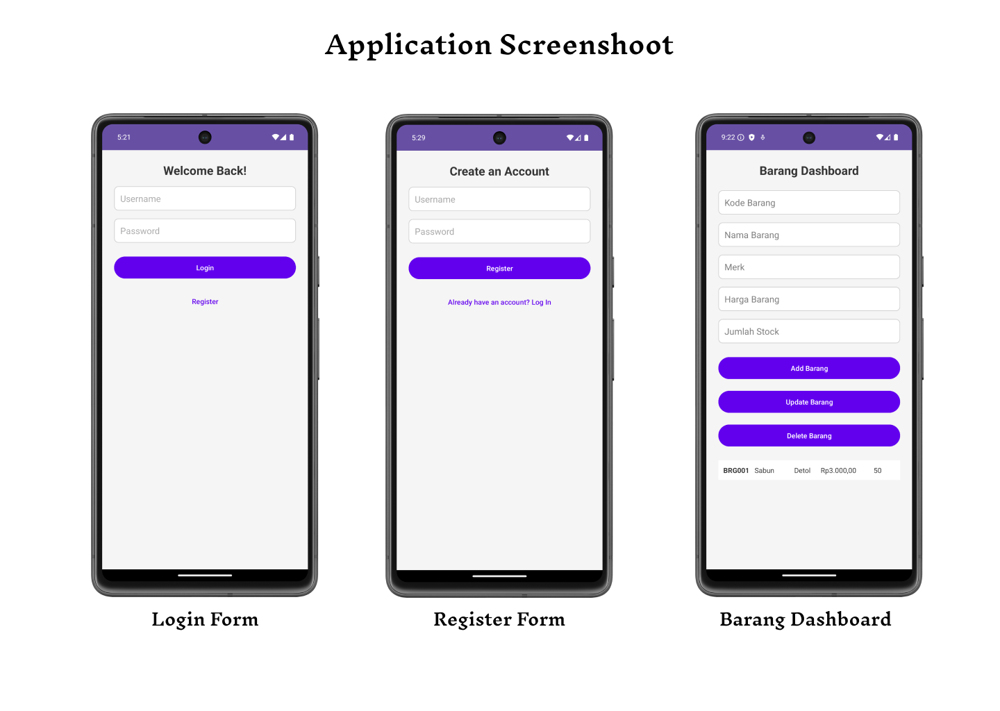

# Barang Management App

A simple inventory management app built for managing and tracking products (barang). The app allows users to perform CRUD (Create, Read, Update, Delete) operations for product details such as Kode, Nama, Merk, Harga, and Stock Quantity. This project is built with **Android** and uses **SQLite** for local data storage.

## Features

- **Add Barang**: Add new products with details such as Kode, Nama, Merk, Harga, and Stock Quantity.
- **Update Barang**: Edit existing products' details.
- **Delete Barang**: Remove products from the inventory.
- **View Barang**: Display a list of products with their details (Kode, Nama, Merk, Harga, Stock).
- **Currency Formatting**: Harga (Price) is displayed in Rupiah currency format.

## Requirements

- Android Studio
- Java 20 or later
- SQLite (used for local storage)

## Installation

1. Clone this repository:
   ```bash
   git clone https://github.com/mhdthariq/ManajemenBarang.git
   ```
2. Open the project in **Android Studio**.
3. Build and run the app on an Android device or emulator.

## Usage

- **Add a new product**: Enter details in the input fields and tap "Add Barang".
- **Update an existing product**: Select a product from the list, edit the details, and tap "Update Barang".
- **Delete a product**: Select a product from the list and tap "Delete Barang".
- View the list of products in a scrollable list.

## Screenshots


